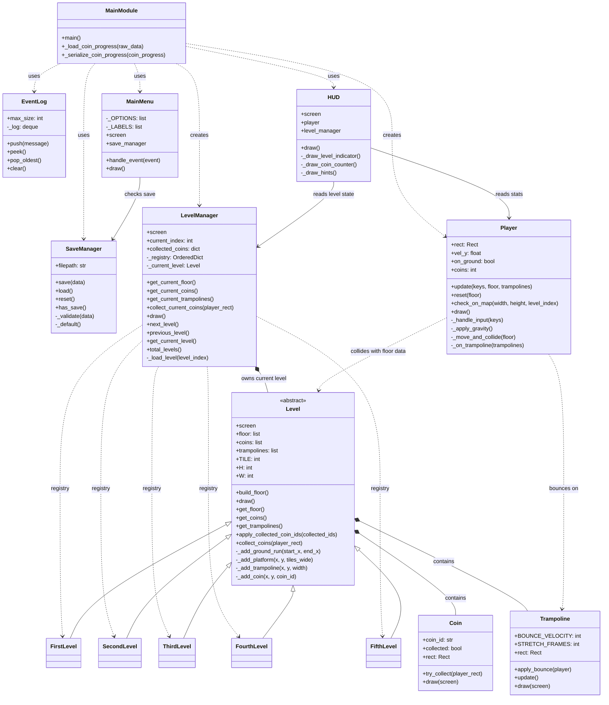

# Project UML

## Notes

- `Main.py` is the entry point and orchestrates menu, gameplay, saving, and win/lose states.
- `LevelManager` owns the currently active `Level` and re-applies collected coin state when levels change.
- `Level` is the abstract base for all five stage classes and contains the shared helpers for floor, coins, and trampolines.
- `Player`, `Coin`, and `Trampoline` drive the main in-level gameplay interactions.
